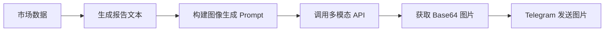

# 🖼️ 图像生成功能设计方案 (多模态模型版)

## 一、功能概述

使用多模态 AI 模型（如 GPT-4o、Gemini 2.0 Flash）将加密货币市场复盘报告转换为精美的视觉海报，并通过 Telegram 推送。

**优势**：复用现有的 `OPENAI_API_KEY` 配置，无需额外的图像生成 API。

## 二、技术方案



### 复用现有配置

| 变量 | 用途 | 说明 |
|------|------|------|
| `OPENAI_API_KEY` | 文本分析 + 图像生成 | 复用同一个 Key |
| `OPENAI_BASE_URL` | API 端点 | 复用同一个 URL |
| `IMAGE_MODEL` | 图像生成模型名称 | 新增，可选配置 |

## 三、环境变量配置

### 现有配置 (已有)

| 变量名 | 说明 | 您的配置 |
|--------|------|----------|
| `OPENAI_API_KEY` | 多模态 API Key | 已配置 |
| `OPENAI_BASE_URL` | API Base URL | 已配置 |

### 新增可选配置

| 变量名 | 说明 | 默认值 |
|--------|------|--------|
| `IMAGE_MODEL` | 图像生成模型名称 | 与 `OPENAI_MODEL` 相同 |
| `IMAGE_SIZE` | 生成图片尺寸 | `1024x1024` |
| `ENABLE_IMAGE_REPORT` | 是否启用图片报告 | `true` |

**如果您不配置 `IMAGE_MODEL`，系统将自动使用 `OPENAI_MODEL` 的值。**

## 四、API 调用方式

### 方式 1: OpenAI Images API (DALL-E 格式)

适用于：GPT-4o、Gemini 2.0 Flash（通过兼容层）

```python
response = requests.post(
    f"{OPENAI_BASE_URL}/images/generations",
    headers={
        "Authorization": f"Bearer {OPENAI_API_KEY}",
        "Content-Type": "application/json"
    },
    json={
        "model": IMAGE_MODEL,  # 如 "gpt-4o" 或 "gemini-2.0-flash"
        "prompt": prompt,
        "n": 1,
        "size": "1024x1024",
        "response_format": "b64_json"  # 返回 Base64 编码的图片
    }
)

image_b64 = response.json()["data"][0]["b64_json"]
image_bytes = base64.b64decode(image_b64)
```

### 方式 2: Chat Completions + 图像输出

某些多模态模型通过 Chat API 生成图像：

```python
response = requests.post(
    f"{OPENAI_BASE_URL}/chat/completions",
    headers={
        "Authorization": f"Bearer {OPENAI_API_KEY}",
        "Content-Type": "application/json"
    },
    json={
        "model": OPENAI_MODEL,
        "messages": [
            {
                "role": "user",
                "content": f"请根据以下数据生成一张加密货币市场复盘海报:\n\n{market_data}"
            }
        ],
        "modalities": ["text", "image"],  # 启用图像输出
        "max_tokens": 4096
    }
)
```

## 五、图像 Prompt 设计

### 市场复盘海报 Prompt

```
请生成一张专业的加密货币市场日报海报图片。

📅 日期: {date}
📊 市场状态: {market_mood}

主要数据:
• BTC: ${btc_price} ({btc_change}%)
• ETH: ${eth_price} ({eth_change}%)
• 总市值: ${total_market_cap}
• 恐慌贪婪指数: {fear_greed_index} ({fear_greed_label})

涨幅榜:
{top_gainers}

设计要求:
1. 深色科技感背景，霓虹灯效果
2. 清晰的数据可视化布局
3. 包含 BTC/ETH 图标
4. 专业金融风格排版
5. 标题: "Crypto Daily Report"
6. 右下角显示日期
```

## 六、模块设计

### 新建 `image_generator.py`

```python
class ImageGenerator:
    """多模态图像生成器"""
    
    def __init__(self):
        self.api_key = os.getenv('OPENAI_API_KEY')
        self.base_url = os.getenv('OPENAI_BASE_URL', 'https://api.openai.com/v1')
        self.model = os.getenv('IMAGE_MODEL') or os.getenv('OPENAI_MODEL')
        self.size = os.getenv('IMAGE_SIZE', '1024x1024')
    
    def is_available(self) -> bool:
        """检查图像生成服务是否可用"""
        return bool(self.api_key and self.model)
    
    def generate_market_poster(self, market_data: dict) -> Optional[bytes]:
        """
        生成市场复盘海报
        
        Args:
            market_data: 市场数据字典
            
        Returns:
            图片二进制数据，失败返回 None
        """
        prompt = self._build_prompt(market_data)
        return self._generate_image(prompt)
    
    def _build_prompt(self, market_data: dict) -> str:
        """构建图像生成 Prompt"""
        ...
    
    def _generate_image(self, prompt: str) -> Optional[bytes]:
        """调用 API 生成图像"""
        ...
```

### 扩展 `notification.py`

```python
class NotificationService:
    
    async def send_photo(
        self, 
        photo: bytes, 
        caption: str = ""
    ) -> bool:
        """
        发送图片到 Telegram
        
        Args:
            photo: 图片二进制数据
            caption: 图片说明文字
        """
        url = f"https://api.telegram.org/bot{self.token}/sendPhoto"
        
        files = {
            'photo': ('report.png', photo, 'image/png')
        }
        data = {
            'chat_id': self.chat_id,
            'caption': caption,
            'parse_mode': 'Markdown'
        }
        
        response = requests.post(url, data=data, files=files)
        return response.status_code == 200
```

### 集成到 `main.py`

```python
async def run_market_analysis(self):
    # ... 获取市场数据 ...
    
    # 生成文本报告
    report = self.market_analyzer.generate_market_review(overview, news)
    
    # 发送文本报告
    await self.notifier.send_message(report)
    
    # 生成并发送图片报告
    if self.config.enable_image_report:
        image_gen = ImageGenerator()
        if image_gen.is_available():
            image_data = image_gen.generate_market_poster(overview.to_dict())
            if image_data:
                await self.notifier.send_photo(
                    photo=image_data,
                    caption="📊 加密货币市场日报"
                )
```

## 七、支持的多模态模型

| 服务商 | 模型 | 图像生成能力 |
|--------|------|-------------|
| OpenAI | GPT-4o | ✅ 通过 DALL-E |
| Google | Gemini 2.0 Flash | ✅ 原生支持 |
| 硅基流动 | Gemini/GPT-4o | ✅ 代理支持 |
| 智谱 AI | GLM-4V | ✅ CogView-3 |

## 八、总结

由于您使用多模态模型，**不需要额外配置**，只需：

1. 确保 `OPENAI_API_KEY` 和 `OPENAI_BASE_URL` 已配置（您已完成）
2. 可选添加 `ENABLE_IMAGE_REPORT=true` 启用图片报告

系统将自动使用同一个 API 进行：
- 文本分析（市场复盘）
- 图像生成（海报）

---

确认方案后，切换到 Code 模式开始实现。
