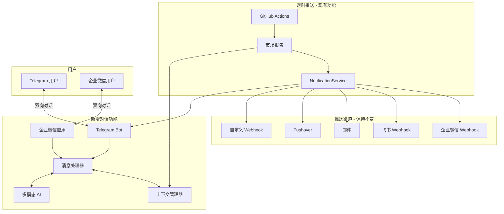

# 🤖 双向对话功能设计方案

## 一、现有功能保留

### 已支持的推送渠道（保持不变）

| 渠道 | 类型 | 配置方式 |
|------|------|----------|
| 企业微信群机器人 | Webhook | `WECHAT_WEBHOOK_URL` |
| 飞书群机器人 | Webhook | `FEISHU_WEBHOOK_URL` |
| Telegram Bot | API | `TELEGRAM_BOT_TOKEN` + `TELEGRAM_CHAT_ID` |
| 邮件 | SMTP | `EMAIL_SENDER` + `EMAIL_PASSWORD` + `EMAIL_RECEIVERS` |
| Pushover | API | `PUSHOVER_USER_KEY` + `PUSHOVER_API_TOKEN` |
| 钉钉 | Webhook | `CUSTOM_WEBHOOK_URLS` |
| Discord | Webhook | `CUSTOM_WEBHOOK_URLS` |
| Slack | Webhook | `CUSTOM_WEBHOOK_URLS` |
| Bark | Webhook | `CUSTOM_WEBHOOK_URLS` |
| 自定义服务 | Webhook | `CUSTOM_WEBHOOK_URLS` |

**以上所有渠道的推送功能保持不变！**

## 二、新增双向对话功能

在现有推送功能基础上，为以下渠道添加**双向对话**能力：

| 渠道 | 推送 | 双向对话 | 新增配置 |
|------|------|----------|----------|
| **Telegram** | ✅ 已有 | 🆕 新增 | 无需新配置 |
| **企业微信应用** | 🆕 新增 | 🆕 新增 | 需新配置 |

### 对话能力

用户可以：
1. 收到定时推送的市场报告
2. 回复消息，与 AI 进行对话
3. AI 会将报告内容作为上下文，理解用户的问题
4. 支持生成图片（如市场海报）

## 三、架构设计



## 四、环境变量配置

### 现有配置（保持不变）

```bash
# 企业微信群机器人（Webhook 推送）
WECHAT_WEBHOOK_URL=https://qyapi.weixin.qq.com/cgi-bin/webhook/send?key=xxx

# 飞书群机器人（Webhook 推送）
FEISHU_WEBHOOK_URL=https://open.feishu.cn/open-apis/bot/v2/hook/xxx

# Telegram Bot（推送 + 对话）
TELEGRAM_BOT_TOKEN=8369103671:AAHRD0JHU_xxx
TELEGRAM_CHAT_ID=888910422

# 邮件
EMAIL_SENDER=your@email.com
EMAIL_PASSWORD=your_password
EMAIL_RECEIVERS=receiver1@email.com,receiver2@email.com

# Pushover
PUSHOVER_USER_KEY=xxx
PUSHOVER_API_TOKEN=xxx

# 自定义 Webhook（钉钉、Discord、Slack 等）
CUSTOM_WEBHOOK_URLS=https://oapi.dingtalk.com/robot/send?access_token=xxx,https://discord.com/api/webhooks/xxx

# AI 模型
OPENAI_API_KEY=sk-xxx
OPENAI_BASE_URL=https://api.xxx.com/v1
OPENAI_MODEL=model-name
```

### 新增配置（企业微信应用双向对话）

```bash
# 企业微信应用（双向对话）- 可选，不影响现有群机器人推送
WECOM_CORP_ID=ww1234567890abcdef
WECOM_AGENT_ID=1000002
WECOM_SECRET=your_secret
WECOM_TOKEN=your_token
WECOM_ENCODING_AES_KEY=your_encoding_aes_key
```

**重要**：企业微信应用配置是**可选的**，不配置时系统仍使用群机器人 Webhook 推送。

## 五、实现计划

### 第一阶段：Telegram 双向对话（优先）

1. 创建 `bot/context_manager.py` - 管理对话上下文
2. 创建 `bot/message_handler.py` - 统一消息处理
3. 创建 `bot/telegram_bot.py` - Telegram 双向对话
4. 创建 `bot/image_generator.py` - 图像生成

**无需新配置，使用现有的 `TELEGRAM_BOT_TOKEN`**

### 第二阶段：企业微信应用（可选）

1. 创建 `bot/wecom_adapter.py` - 企业微信应用适配器
2. 更新 `config.py` - 添加企业微信应用配置
3. 部署 Webhook 回调接口

**需要额外配置企业微信应用**

## 六、文件结构

```
crypto-analysis/
├── bot/                          # 🆕 新增模块
│   ├── __init__.py
│   ├── context_manager.py        # 上下文管理
│   ├── message_handler.py        # 统一消息处理
│   ├── image_generator.py        # 图像生成
│   ├── telegram_bot.py           # Telegram 双向对话
│   └── wecom_adapter.py          # 企业微信应用
│
├── notification.py               # ✅ 保持不变（所有推送渠道）
├── config.py                     # 添加企业微信应用配置
├── main.py                       # 集成对话功能
├── app.py                        # Gradio Web UI
└── ...
```

## 七、对话示例

```
[系统推送 15:00]
🎯 加密货币市场复盘
BTC: $95,473 (+0.33%)
涨幅榜: AXS +70.98%

[用户 15:05]
AXS 为什么涨这么多？

[AI 回复]
根据今日市场报告，AXS (Axie Infinity) 上涨 70.98%，
可能原因包括：
1. GameFi 板块回暖
2. 项目方发布重大更新
3. 技术面超跌反弹
建议关注官方公告了解具体信息。

[用户]
生成一张今天的市场海报

[AI 回复]
🎨 正在生成...
[图片]
```

## 八、总结

| 功能 | 状态 | 说明 |
|------|------|------|
| 企业微信群机器人推送 | ✅ 保持 | Webhook 方式 |
| 飞书群机器人推送 | ✅ 保持 | Webhook 方式 |
| Telegram 推送 | ✅ 保持 | Bot API |
| 邮件推送 | ✅ 保持 | SMTP |
| Pushover 推送 | ✅ 保持 | API |
| 钉钉/Discord/Slack 推送 | ✅ 保持 | 自定义 Webhook |
| **Telegram 双向对话** | 🆕 新增 | 无需新配置 |
| **企业微信应用双向对话** | 🆕 新增 | 可选配置 |

---

确认方案后，切换到 Code 模式开始实现。

**建议先实现 Telegram 双向对话**（无需新配置），然后再添加企业微信应用支持。
