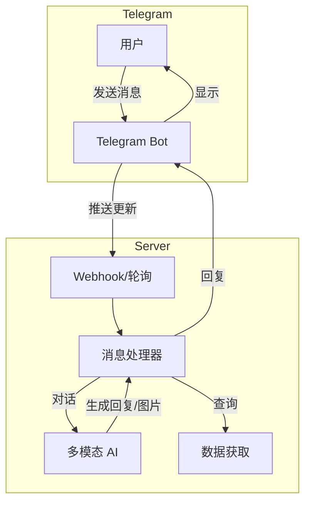

# 🤖 交互式 Telegram Bot 设计方案

## 一、功能概述

创建一个交互式 Telegram Bot，用户可以：

1. **接收定时推送** - 每日市场复盘报告（现有功能）
2. **发送命令查询** - 查询特定币种、市场数据
3. **自由对话** - 与 AI 进行加密货币相关对话
4. **生成图片** - 请求生成市场海报、分析图表

## 二、技术架构



## 三、Bot 命令设计

| 命令 | 功能 | 示例 |
|------|------|------|
| `/start` | 欢迎消息，显示帮助 | `/start` |
| `/help` | 显示所有可用命令 | `/help` |
| `/market` | 获取当前市场概览 | `/market` |
| `/price <币种>` | 查询币种实时价格 | `/price BTC` |
| `/analyze <币种>` | AI 分析特定币种 | `/analyze ETH` |
| `/top` | 涨跌榜 TOP 10 | `/top` |
| `/fear` | 恐慌贪婪指数 | `/fear` |
| `/poster` | 生成市场海报图片 | `/poster` |
| `/ask <问题>` | 向 AI 提问 | `/ask BTC 今天会涨吗` |

## 四、自由对话功能

除了命令，用户可以直接发送任意消息与 Bot 对话：

```
用户: BTC 现在多少钱？
Bot: 🪙 BTC/USDT 当前价格: $95,473.00
     24H 涨跌: +0.33%
     24H 最高: $96,200.00
     24H 最低: $94,800.00

用户: 帮我分析一下 SOL
Bot: 📊 SOL/USDT 分析报告
     ...

用户: 生成一张今天的市场海报
Bot: [图片]
```

## 五、技术实现

### 依赖库

```
python-telegram-bot>=21.0
```

### 部署方式对比

| 方式 | 优点 | 缺点 | 适用场景 |
|------|------|------|----------|
| **长轮询 (Polling)** | 简单，无需公网 IP | 资源占用较高 | 开发/测试 |
| **Webhook** | 高效，实时响应 | 需要公网 HTTPS | 生产环境 |

### 推荐：HuggingFace Spaces + Webhook

您已经有 HuggingFace Spaces 部署的 Gradio 应用，可以：
1. 在同一 Space 中运行 Telegram Bot Webhook
2. 共用 AI 模型和数据获取模块
3. 无需额外服务器

## 六、代码结构

### 新建 `telegram_bot.py`

```python
import os
import logging
from telegram import Update
from telegram.ext import (
    Application,
    CommandHandler,
    MessageHandler,
    filters,
    ContextTypes
)

from config import get_config
from data_provider import CCXTFetcher
from crypto_analyzer import CryptoTrendAnalyzer
from analyzer import GeminiAnalyzer
from image_generator import ImageGenerator

logger = logging.getLogger(__name__)


class CryptoTelegramBot:
    """加密货币分析 Telegram Bot"""
    
    def __init__(self):
        self.config = get_config()
        self.token = self.config.telegram_bot_token
        
        # 初始化组件
        self.ccxt = CCXTFetcher(exchange='okx')
        self.trend_analyzer = CryptoTrendAnalyzer()
        self.ai_analyzer = GeminiAnalyzer()
        self.image_generator = ImageGenerator()
        
        # 对话历史 (简单实现，可扩展为 Redis)
        self.chat_history = {}
    
    async def start(self, update: Update, context: ContextTypes.DEFAULT_TYPE):
        """处理 /start 命令"""
        welcome = """
🪙 **加密货币智能分析 Bot**

我可以帮你：
• 查询实时价格 - `/price BTC`
• 分析币种趋势 - `/analyze ETH`
• 查看市场概览 - `/market`
• 生成市场海报 - `/poster`
• 自由对话 - 直接发消息问我

输入 /help 查看所有命令
"""
        await update.message.reply_text(welcome, parse_mode='Markdown')
    
    async def help(self, update: Update, context: ContextTypes.DEFAULT_TYPE):
        """处理 /help 命令"""
        help_text = """
📖 **命令列表**

/market - 市场概览
/price <币种> - 查询价格
/analyze <币种> - AI 分析
/top - 涨跌榜
/fear - 恐慌贪婪指数
/poster - 生成市场海报

💬 **自由对话**
直接发送消息，我会用 AI 回答你！
"""
        await update.message.reply_text(help_text, parse_mode='Markdown')
    
    async def price(self, update: Update, context: ContextTypes.DEFAULT_TYPE):
        """处理 /price 命令"""
        if not context.args:
            await update.message.reply_text("用法: /price <币种>\n例如: /price BTC")
            return
        
        symbol = context.args[0].upper()
        if not symbol.endswith('/USDT'):
            symbol = f"{symbol}/USDT"
        
        quote = self.ccxt.get_realtime_quote(symbol)
        if quote:
            msg = f"""
🪙 **{symbol}**

💰 价格: ${quote.price:,.2f}
📈 24H涨跌: {quote.change_24h:+.2f}%
📊 24H最高: ${quote.high_24h:,.2f}
📉 24H最低: ${quote.low_24h:,.2f}
💹 24H成交: ${quote.quote_volume_24h:,.0f}
"""
            await update.message.reply_text(msg, parse_mode='Markdown')
        else:
            await update.message.reply_text(f"❌ 无法获取 {symbol} 价格")
    
    async def analyze(self, update: Update, context: ContextTypes.DEFAULT_TYPE):
        """处理 /analyze 命令 - AI 分析"""
        if not context.args:
            await update.message.reply_text("用法: /analyze <币种>\n例如: /analyze BTC")
            return
        
        symbol = context.args[0].upper()
        if not symbol.endswith('/USDT'):
            symbol = f"{symbol}/USDT"
        
        await update.message.reply_text(f"🔍 正在分析 {symbol}...")
        
        # 获取数据并分析
        kline = self.ccxt.get_kline(symbol, timeframe='1d', limit=100)
        if kline and not kline.data.empty:
            trend_result = self.trend_analyzer.analyze(kline.data, symbol)
            
            # AI 生成分析报告
            prompt = f"请分析 {symbol} 的走势，当前信号评分 {trend_result.signal_score}，趋势状态 {trend_result.technical_indicators.trend_status}"
            ai_response = self.ai_analyzer._call_openai_api(prompt, {})
            
            await update.message.reply_text(ai_response, parse_mode='Markdown')
        else:
            await update.message.reply_text(f"❌ 无法获取 {symbol} 数据")
    
    async def poster(self, update: Update, context: ContextTypes.DEFAULT_TYPE):
        """处理 /poster 命令 - 生成市场海报"""
        await update.message.reply_text("🎨 正在生成市场海报...")
        
        # 获取市场数据
        from crypto_market_analyzer import CryptoMarketAnalyzer
        market_analyzer = CryptoMarketAnalyzer(ccxt_fetcher=self.ccxt)
        overview = market_analyzer.get_market_overview()
        
        # 生成图片
        image_data = self.image_generator.generate_market_poster(overview.to_dict())
        
        if image_data:
            await update.message.reply_photo(
                photo=image_data,
                caption="📊 加密货币市场日报"
            )
        else:
            await update.message.reply_text("❌ 图片生成失败")
    
    async def handle_message(self, update: Update, context: ContextTypes.DEFAULT_TYPE):
        """处理自由对话消息"""
        user_id = update.effective_user.id
        user_message = update.message.text
        
        # 获取对话历史
        if user_id not in self.chat_history:
            self.chat_history[user_id] = []
        
        self.chat_history[user_id].append({
            "role": "user",
            "content": user_message
        })
        
        # 保留最近 10 条对话
        self.chat_history[user_id] = self.chat_history[user_id][-10:]
        
        # 构建带上下文的 Prompt
        system_prompt = """你是一个专业的加密货币分析助手。
用户可能会问你关于加密货币价格、市场分析、投资建议等问题。
请用中文简洁专业地回答。
如果用户问具体价格，告诉他们使用 /price 命令。
如果用户想要图片，告诉他们使用 /poster 命令。"""
        
        messages = [{"role": "system", "content": system_prompt}]
        messages.extend(self.chat_history[user_id])
        
        # 调用 AI
        response = self.ai_analyzer._call_openai_chat(messages)
        
        if response:
            self.chat_history[user_id].append({
                "role": "assistant",
                "content": response
            })
            await update.message.reply_text(response, parse_mode='Markdown')
        else:
            await update.message.reply_text("🤔 抱歉，我现在无法回答，请稍后重试。")
    
    def run_polling(self):
        """使用长轮询模式运行 Bot"""
        app = Application.builder().token(self.token).build()
        
        # 注册命令处理器
        app.add_handler(CommandHandler("start", self.start))
        app.add_handler(CommandHandler("help", self.help))
        app.add_handler(CommandHandler("price", self.price))
        app.add_handler(CommandHandler("analyze", self.analyze))
        app.add_handler(CommandHandler("poster", self.poster))
        
        # 注册消息处理器 (处理非命令消息)
        app.add_handler(MessageHandler(
            filters.TEXT & ~filters.COMMAND, 
            self.handle_message
        ))
        
        logger.info("🤖 Bot 启动中 (Polling 模式)...")
        app.run_polling()


if __name__ == "__main__":
    bot = CryptoTelegramBot()
    bot.run_polling()
```

## 七、部署方案

### 方案 A: 本地/服务器长轮询

最简单的方式，适合测试：

```bash
# 后台运行
nohup python telegram_bot.py &
```

### 方案 B: HuggingFace Spaces (推荐)

修改现有的 `app.py`，在 Gradio 应用中集成 Bot：

```python
import threading
from telegram_bot import CryptoTelegramBot

# 在后台线程运行 Bot
def run_bot():
    bot = CryptoTelegramBot()
    bot.run_polling()

bot_thread = threading.Thread(target=run_bot, daemon=True)
bot_thread.start()

# Gradio 应用正常启动
demo.launch(...)
```

### 方案 C: GitHub Actions + Webhook

使用 Cloudflare Workers 或其他 Serverless 服务接收 Webhook。

## 八、环境变量

无需新增环境变量，复用现有配置：

| 变量 | 说明 |
|------|------|
| `TELEGRAM_BOT_TOKEN` | 已配置 ✅ |
| `TELEGRAM_CHAT_ID` | 已配置 ✅ |
| `OPENAI_API_KEY` | AI 对话 + 图像生成 |
| `OPENAI_BASE_URL` | API 端点 |
| `OPENAI_MODEL` | 模型名称 |

## 九、功能演示

```
用户: /start

Bot: 🪙 加密货币智能分析 Bot
     我可以帮你查询价格、分析趋势、生成海报...

用户: /price BTC

Bot: 🪙 BTC/USDT
     💰 价格: $95,473.00
     📈 24H涨跌: +0.33%
     ...

用户: 今天市场怎么样？

Bot: 今日加密货币市场整体呈现小幅上涨态势...
     BTC 主导率维持在 57.3%...
     恐慌贪婪指数为 50，市场情绪中性...

用户: 帮我生成一张海报

Bot: 🎨 正在生成市场海报...
     [图片]
```

---

确认此方案后，切换到 Code 模式开始实现。
